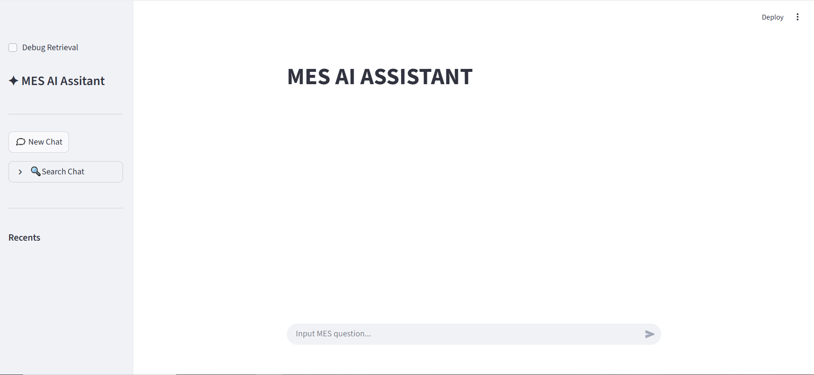
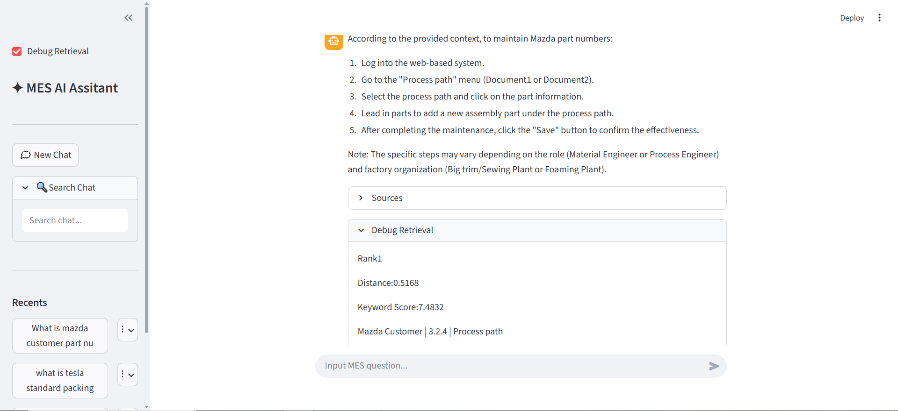
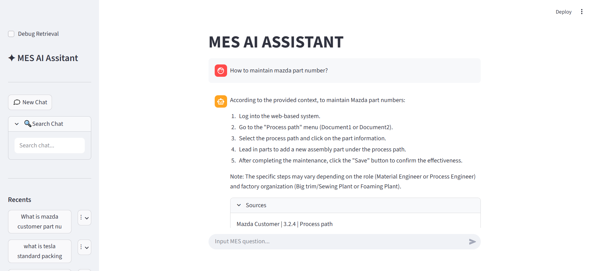

# MES AI Assistant


An AI-powered Manufacturing Execution System (MES) documentation assistant built with Retrieval-Augmented Generation (RAG), ChromaDB, Ollama, and Streamlit.

The assistant enables users to query MES documentation in natural language and receive accurate, context-aware answers with source references. It supports streaming responses, metadata filtering, hybrid retrieval, and retrieval debugging, making it a practical AI assistant for MES documentation search and question answering.

## Features

- **Retrieval-Augmented Generation (RAG)** for accurate document-based question answering.
- **ChromaDB Vector Database** for semantic document retrieval.
- **Metadata Filtering** to retrieve customer-specific documentation.
- **Hybrid Retrieval** combining semantic search with keyword-based reranking.
- **Streaming Response** for a real-time ChatGPT-like user experience.
- **Conversation Memory** to preserve recent chat context during multi-turn conversations.
- **Embedding Cache** to reduce repeated embedding computation.
- **Source Traceability** displaying document references for every answer.
- **Retrieval Debug Panel** showing retrieval scores, distances, and retrieved documents for troubleshooting.

## Architecture

```text
                 User Question
                        │
                        ▼
             Conversation History
                        │
                        ▼
              Query Embedding
                        │
                        ▼
          ChromaDB Vector Database
                        │
                        ▼
      Metadata Filtering (Customer)
                        │
                        ▼
          Hybrid Retrieval + Reranking
                        │
                        ▼
            Prompt Construction
                        │
                        ▼
                Llama 3 (Ollama)
                        │
                        ▼
            Streaming Response
                        │
                        ▼
          Answer + Source References
```

## Demo


### Chat Interface



### Source References



### Retrieval Debug 



## Installation

Clone the repository:

```bash
git clone https://github.com/your_username/MES-AI-Assistant.git
cd MES-AI-Assistant
```

Install dependencies:

```bash
pip install -r requirements.txt
```

Build the vector database:

```bash
python build_db.py
```

Launch the application:

```bash
streamlit run ui.py
```

## Usage
1. Launch the Streamlit application.
2. Ask questions in natural language.
3. The assistant retrieves relevant MES documentation.
4. Llama 3 generates an answer based on the retrieved context.
5. Source references are displayed below each answer.

## Future Improvements
- Cross-Encoder reranking
- Multi-query retrieval
- Long-term conversation memory
- Citation highlighting
- Support multiple LLM backends (Llama 3, Qwen, DeepSeek, etc.)
- Docker deployment
- REST API support

## Project Structure

```text
MES-AI-Assistant/
│
├── ui.py                # Streamlit user interface
├── build_db.py          # Build the ChromaDB knowledge base
├── rag.py               # RAG pipeline
├── vectorstore.py       # Retrieval and vector database operations
├── embedding.py         # Embedding generation
├── parser.py            # Document parser
├── storage.py           # Chat history management
├── data/
│   └── chromadb/        # Vector database
├── requirements.txt
├── README.md
└── .gitignore
```

